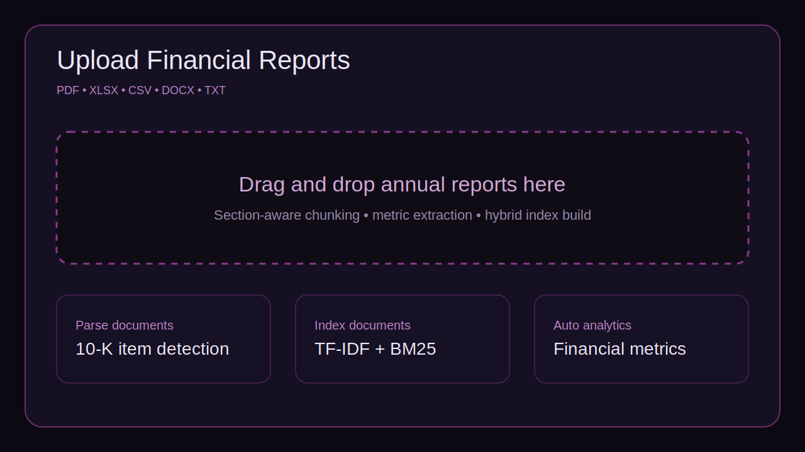
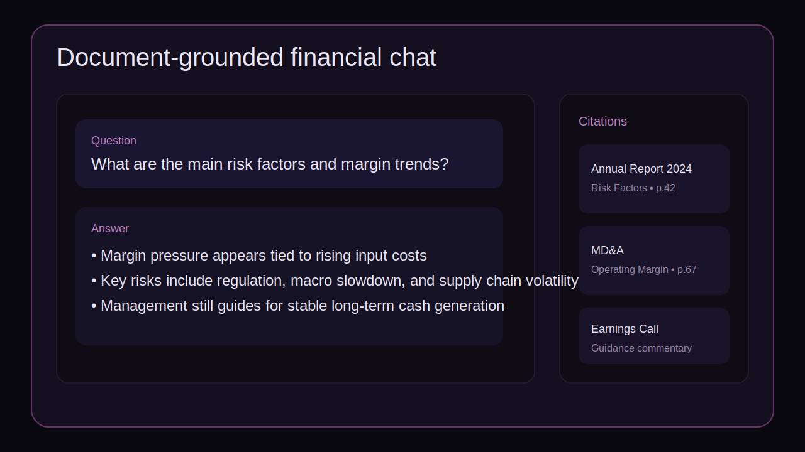
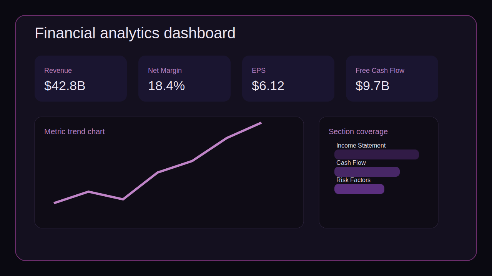
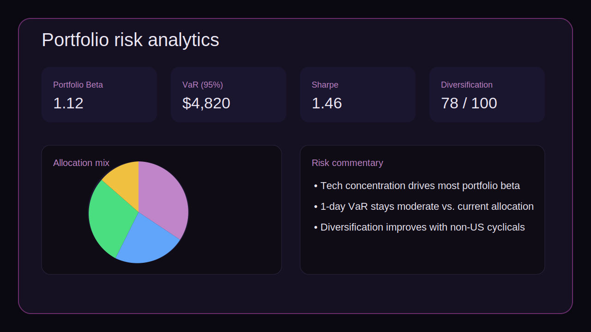
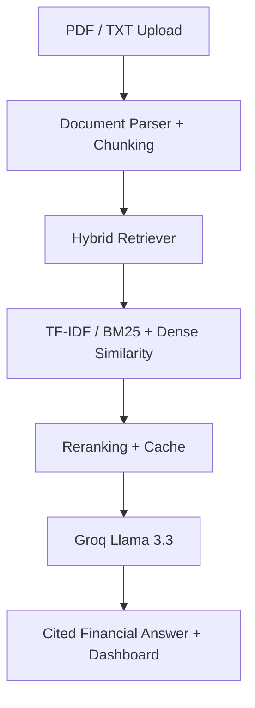

# Financial RAG Assistant

AI-native financial intelligence platform for document-grounded Q&A, market analytics, and portfolio risk insights.

Built with Streamlit, Groq Llama 3.3, hybrid BM25 retrieval, financial metric extraction, live market data, and interactive Plotly dashboards.

## Live demo

[financial-rag-assistant.streamlit.app](https://financial-rag-assistant.streamlit.app/)

The public Streamlit deployment uses a cloud-safe hosted entrypoint for faster first render. The original immersive studio UI is still preserved in `studio_app.py`.

## What it does

Financial RAG Assistant combines document intelligence with live finance workflows in one interface:

- Upload annual reports, 10-Ks, earnings material, spreadsheets, CSVs, DOCX, or text notes
- Ask grounded financial questions and get cited answers from uploaded documents
- Run hybrid retrieval with TF-IDF + BM25 + RRF fusion + optional reranking
- Auto-extract financial metrics from documents into dashboards
- Track live stocks, crypto, FX, commodities, and macro headlines
- Analyze portfolio performance, diversification, beta, VaR, and Sharpe-style metrics

## Core capabilities

### Document intelligence

- PDF, TXT, CSV, XLSX/XLS, and DOCX ingestion
- 10-K-aware section detection and chunking
- Financial taxonomy tagging
- Chunk keyword enrichment
- Auto metric extraction for revenue, margins, EPS, ratios, cash flow, and more

### Retrieval and answer generation

- Hybrid retrieval:
  - TF-IDF similarity
  - BM25 keyword retrieval
  - Reciprocal Rank Fusion
  - optional cross-encoder reranking fallback
- Retrieval cache for repeated queries
- Retrieval analytics and benchmark helpers
- Groq-hosted Llama 3.3 answer generation through the OpenAI-compatible API
- Source-cited financial answers

### Live finance layer

- Market data pulled from Yahoo Finance endpoints
- News context for market-grounded responses
- Equity and crypto tracking
- Portfolio P&L, concentration, and risk views
- Interactive Plotly visualizations

## Product previews

These visual previews are included in [`screenshots/`](screenshots/).






## Architecture



## Key engineering decisions

- Used hybrid retrieval to improve recall over purely semantic search.
- Added retrieval caching to reduce repeated query latency.
- Used Groq-hosted Llama 3.3 for faster answer generation.
- Designed financial taxonomy-based chunk tagging for better domain relevance.
- Built a live analytics layer for stocks, crypto, commodities, and FX.
- Added 10-K-aware section chunking to reduce cross-section retrieval noise.

## Repository structure

```text
financial-rag-assistant/
├── app.py
├── streamlit_app.py
├── studio_app.py
├── src/
│   ├── analytics.py
│   ├── config.py
│   ├── deploy_ui.py
│   ├── document_parser.py
│   ├── llm.py
│   ├── market_data.py
│   ├── retriever.py
│   └── ui.py
├── tests/
├── screenshots/
├── .env.example
├── Dockerfile
├── requirements.txt
└── README.md
```

## Setup

### Local

```bash
python -m venv .venv
source .venv/bin/activate
pip install -r requirements.txt
cp .env.example .env
streamlit run app.py
```

### Entry points

- `app.py` and `streamlit_app.py`: lightweight hosted demo used for Streamlit deployment
- `studio_app.py`: original full-screen studio UI preserved for local exploration

### Environment

Create a `.env` file from `.env.example`:

```env
GROQ_API_KEY=your_api_key_here
```

## Dependencies

Important runtime dependencies now include:

- `streamlit`
- `pandas`
- `numpy`
- `plotly`
- `requests`
- `python-dotenv`
- `rank-bm25`
- `scikit-learn`
- `openai`
- `pypdf`
- `pdfplumber`
- `pymupdf`
- `openpyxl`
- `python-docx`

## Run with Docker

```bash
docker build -t financial-rag-assistant .
docker run -p 8501:8501 --env-file .env financial-rag-assistant
```

## Limitations

- Not production-authenticated yet.
- Currently Streamlit-first, not FastAPI microservice-based.
- Uploaded files are handled in-session, not persisted per user.
- No tenant-level access control yet.
- Some advanced reranking paths are optional and degrade gracefully when heavier packages are unavailable.

## Roadmap

- FastAPI backend
- PostgreSQL metadata store
- Multi-user authentication
- Vector DB persistence
- Docker deployment hardening
- CI/CD with GitHub Actions
- Evaluation dataset for financial QA
- Stable hosted demo deployment

## Notes for reviewers

The original repo surface undersold the project because the README and package story did not match the actual code. This cleanup makes the repository reflect the implementation more honestly:

- Groq / Llama 3.3 instead of OpenAI GPT-3.5 as the primary generation path
- Hybrid retrieval instead of only vector DB search
- Portfolio and market analytics included, not just document chat
- Modular `src/` structure instead of a single top-level app file
